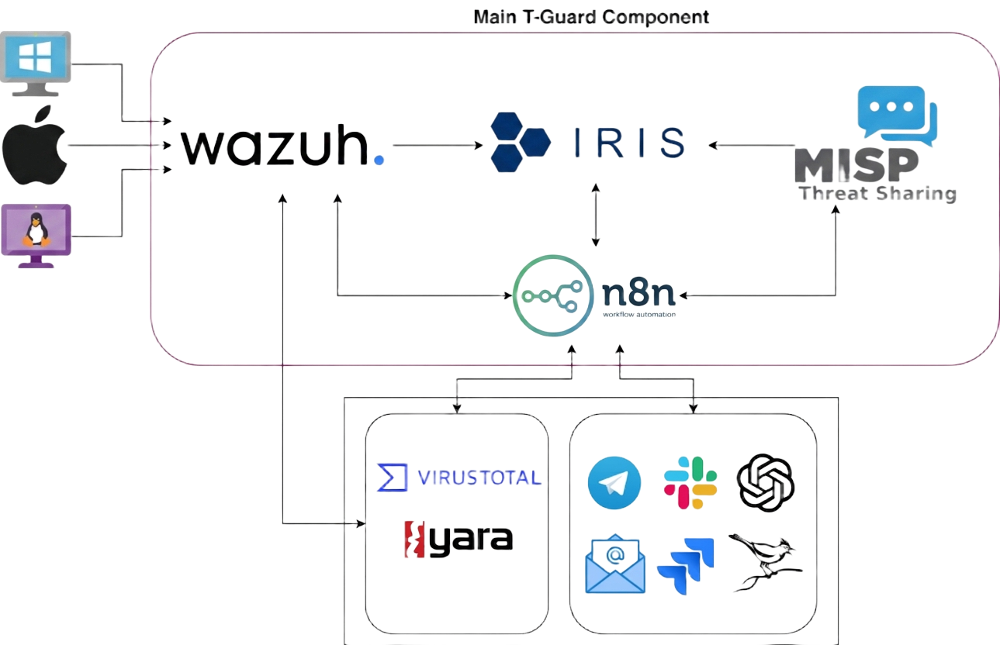

## Architecture

This diagram represents an integrated SOC workflow, utilizing various tools and platforms for comprehensive cybersecurity management\[cite: 276\]. Here are the descriptions and functionalities of every component within T-Guard:

- **Wazuh Agents**: Various devices such as Mac, Windows, and Linux machines, as well as IoT devices and sensors, are sources of logs\[cite: 26\]. These logs are crucial for monitoring and analysis purposes and they are sent to the Wazuh platform\[cite: 26\].
- **Wazuh Server**: This is the central SIEM system that receives logs from the different devices\[cite: 26\]. It acts as a security detection system to identify potential threats from the collected logs\[cite: 142\].
- **IRIS**: Depending on the threshold and rules we set, Wazuh will forward the logs into the IRIS platform for incident case management\[cite: 466\].
- **Threat Sharing (MISP)**: IRIS exchanges indicators of compromise with MISP (Malware Information Sharing Platform & Threat Sharing)\[cite: 10, 466\]. This is a community-driven platform for sharing, storing, and correlating indicators of compromise of targeted attacks\[cite: 26\].
- **n8n as SOAR**: Acting as the Security Orchestration, Automation, and Response (SOAR) engine, n8n sits between IRIS and the surrounding toolset to automate the incident response workflow\[cite: 10, 466\]. It queries enrichment sources such as VirusTotal and YARA to score and classify suspicious indicators, and dispatches alerts and case updates to the team's configured collaboration channels (e.g. Telegram, Slack, Microsoft Teams, email, and other integrated tools)\[cite: 467, 470\]. SOAR platforms like this are designed to help security teams manage and respond to endless alarms at machine speeds.