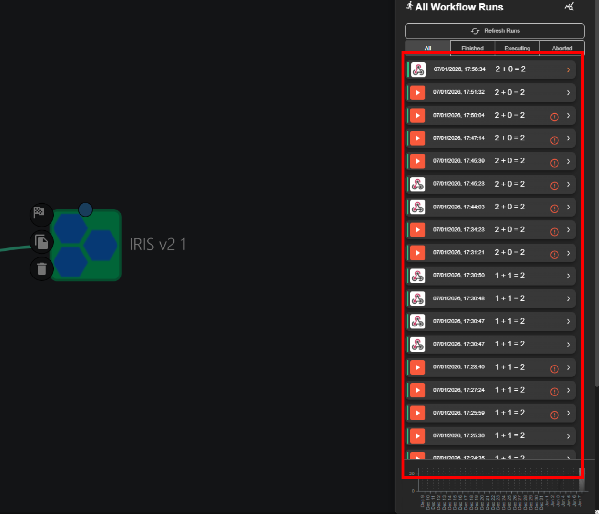
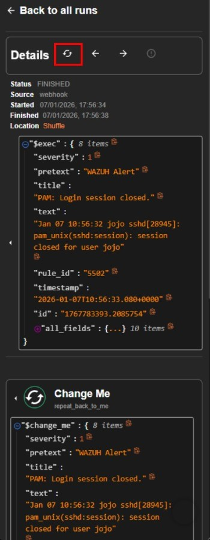
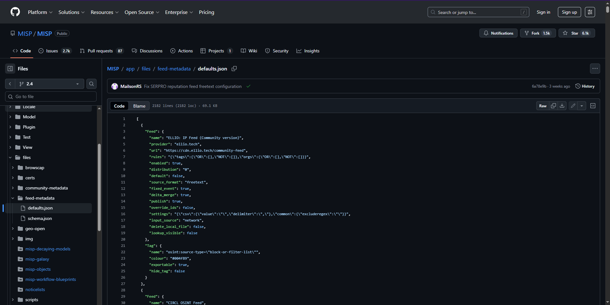

# Prerequisites

- Fresh machine with Ubuntu 24.04 LTS (other Linux OS may work as well, but not tested). We do not recommend using machines that have other services running except you understand what you are doing.
- System Requirements:
- Broadband internet connections

|                                                                                         | **CPU** | **RAM**<br />**(GB)** | **Storage**<br />**(GB)** | **Remarks**                     |
| --------------------------------------------------------------------------------------- | :-----: | :-------------------: | :-----------------------: | :-----------------------------: |
| **Minimum Requirements**<br />_For trial deployments_                                   | 8       | 16                    | 100                       | Swap memory activation required |
| **Standard Requirements**<br />_For production environments and continuous development_ | 8       | 32                    | 250                       | No need swap memory             |

# Installation Steps

First, you need to clone the repository:

```
git clone https://github.com/sguresearcher/nusantara.git
```

Move to the directory and execute the installation script:

```
cd nusantara
chmod +x setup.sh
./setup.sh
```

To install the main T-Guard components, follow instructions below.

<Frame caption="Figure 1. T-Guard Installer Main Menu">
  
</Frame>

## **Step 1: Update System and Install Prerequisites**

In the **Main Menu**, type ‘**1**’ and press Enter.

This will update existing packages, install all necessary dependencies, and set up Docker.

Wait for the process to complete and it will then return to the **Main Menu**.

## **Step 2: Install T-Guard SOC Package**

In the **Main Menu**, type ‘**2**’ and press Enter.

You’ll see a menu to choose the current network environment of your system for installing T-Guard, as shown in Figure 2.

<Frame caption="FIgure 2. Network Environtment Options">
  
</Frame>

If you are using a local virtual machine, such as VirtualBox or VMware, choose option ‘**1**’.

If you are using a cloud-based virtual machine, such as Google Cloud Platform (GCP), Amazon Web Services (AWS), or Microsoft Azure, choose option ‘**2**’.

The installation process will start sequentially, beginning with Wazuh (include deploy initial wazuh agent), followed by Shuffle, IRIS, and MISP, as shown in Figure 3, 4, 5, and 6, respectively.

<Frame caption="Figure 3. Wazuh Installation">
  
</Frame>

<Frame caption="Figure 4. Shuffle Installation">
  
</Frame>

<Frame caption="Figure 5. IRIS-DFIR Instalation">
  
</Frame>

<Frame caption="Figure 6. MISP Installation">
  
</Frame>

Once the process is complete, a table will appear displaying dashboard access details and credentials for each module, as shown in Figure 7.

<Frame caption="Figure 7. Dashboard Access and Default Credentials">
  
</Frame>

Open your browser and follow the link to access your dashboard.

<Frame caption="Figure 8. Warning Page">
  
</Frame>

You will see a warning from the browser that the certificate is invalid as illustrated in Figure 8. This is normal because we haven’t installed the signed SSL certificate, which is recommended for production. For now, just click proceed.

The first page of Wazuh should be as illustrated in Figure 9.

<Frame caption="Figure 9. Wazuh Login Page">
  
</Frame>

Log in using **above mentioned credentials**. After log in, you should see Figure 10.

<Frame caption="Figure 10. Wazuh Dashboard">
  
</Frame>

Next, open Shuffle dashboard.

Create administrator account using **above mentioned credentials** and then login using the same credentials. After logged in, you should see Figure 11.

<Frame caption="Figure 11. Shuffle Dashboard">
  
</Frame>

Next, open IRIS dashboard.

Sign in using **above mentioned credentials**. After logged in, you should see Figure 12.

<Frame caption="Figure 12. IRIS Dashboard">
  
</Frame>

Next, open MISP dashboard.

Sign in using **above mentioned credentials**. After logged in, you should see Figure 13.

<Frame caption="Figure 13. MISP Dashboard">
  
</Frame>

### **Credential Summary – T-Guard Modules**

| **Service** | **Web Interface**   | **Username**                                | **Password**          |
| ----------- | ------------------- | ------------------------------------------- | --------------------- |
| Wazuh       | https://\<ip\>      | admin                                       | SecretPassword        |
| DFIR-IRIS   | https://\<ip\>:8443 | administrator                               | MySuperAdminPassword! |
| Shuffle     | http://\<ip\>:3001  |  Create your own                             | Create your own |
| MISP        | https://\<ip\>:1443 | [admin@admin.test](mailto:admin@admin.test) | admin                 |

# Integration Steps

In the **Main Menu**, type ‘**3**’ and press Enter.

The system will prompt you to enter the IRIS API key, as shown in Figure 14.

<Frame caption="Figure 14. Input API KEY">
  
</Frame>

To obtain it, navigate to the IRIS page, select the Administrator profile, then go to **My Settings**.

<Frame>
  
</Frame>

The API key will be displayed.

<Frame>
  
</Frame>

Copy and paste it to the installation, then press **Enter**. Wait until the process is finished.

During the installation process, you will be prompted to enter several integration parameters. Please follow the instructions below carefully.

<Frame>
  
</Frame>

# Shuffle Webhook URL
Then, you’ll be prompted to enter your Shuffle Webhook URL.

<Frame>
  
</Frame>

To obtain the URL, follow the instructions below.

- Go to your Shuffle dashboard.
- Select **Workflows**.
- Select **Create Workflow**.
- Specify your preferred **workflow name**—for example, *Sample workflow* — then select **Create from scratch**.
- In the left panel, under the **Triggers** tab, drag the **Webhook** icon to the middle panel as illustrated below.

---

### Step 1: Create a New Workflow

<Frame>
  
</Frame>

---

### Step 2: Select Create from Scratch

<Frame>
  
</Frame>

---

### Step 3: Add Webhook Trigger

<Frame>
  
</Frame>

- Click on **Webhook** module, then it will show up the configuration panel on the right.
  - In the "Webhook URL" parameter, manually copy the URL by **highlighting it until the end of the url**, then press **Ctrl+C**.

<Frame>
  
</Frame>

- Paste it to the installation terminal, then press **Enter**. Wait until the process is finished.
- Go back to the Shuffle, click the **Start** button as illustrated below.

<Frame>
  
</Frame>

- Next, select the **Shuffle** module in the middle panel, then it will show up the configuration panel on the right.
  - In the "Find Actions" parameter, make sure to select '**Repeat back to me**'.
  - In the "Call" parameter, change the value to `$exec`, then click the **Save** button, as illustrated below.

<Frame>
  
</Frame>

Click the **Test Execution** button (play icon).

<Frame>
  
</Frame>

Select **Run without Runtime Argument**.

<Frame>
  
</Frame>

Then, you'll see the All Workflow Runs panel on the right side.

<Frame>
  
</Frame>

Next, on the left panel, select Apps tab, type **IRIS** in the Search Active Apps bar. Just click the **IRIS V2** (not IRIS V2 Fork), and wait until the **IRIS v2** is show up

Then drag it to the middle panel as illustrated below.

<Frame>
  
</Frame>

Click IRIS Module, then fill the following parameters:

- Find Actions: **Add a new case**
- Apikey: (insert your IRIS API Key)
- Url: (your IRIS url)

Before proceeding to the **Advanced** settings on the right side, you must first configure **Authentication** for the IRIS module.

## Configure IRIS Authentication

1. In the Shuffle workflow editor, click the **IRIS module**.
2. Locate the **Authentication** section.
3. Click the **`+` (Add Authentication)** button.
4. Select **IRIS_API** as the authentication type.
5. Fill in the required fields:
   - **API Key**: Paste your IRIS API Key
   - **URL**: Enter your IRIS base URL (for example: `https://192.168.101:8443`)
6. Click **Submit**.
7. Ensure the authentication status shows **Valid**.

<Frame>
  
</Frame>

<Frame>
  
</Frame>

---

## Configure IRIS Action

After authentication is successfully configured, continue with the action setup.

1. Under **Find Actions**, select **Add a new case**.
2. Verify that the **Authentication** field is set to **IRIS_API**.
3. Ensure the following parameters are filled:
   - **Find Actions**: **Add a new case**
   - **Authentication**: **IRIS_API**
   - **API Key**: Automatically loaded from authentication
   - **URL**: Automatically loaded from authentication

---

Choose the Advanced on the right side, and click the Expand Window Button.

<Frame>
  
</Frame>

Scroll down to the Body parameter, and click the Expand Window button.

<Frame>
  
</Frame>

Change the body content with the following:

```
{  
{
  "case_customer": 1,
  "case_soc_id": 1,
  "cid": 1,
  "case_name":
"$exec.rule.description",
  "case_description": "Log Level:
$exec.rule.level \n\n Full Log:
$exec.full_log",
  "case_severity_id": 2,
  "case_status_id": 1,
  "ioc": "$exec.data.srcip"
}
}
```

Then, click Try It button on the top right. Wait until the result is show up in the bottom.

After that, click **Submit** button on the bottom right.

Then, click **Save** button.

<Frame>
  
</Frame>

Click the **Show Executions** button to open the **All Workflow Runs** panel. You should see alerts from Wazuh listed here.

<Frame>
  
</Frame>

Then, click on the alerts with the following icon.

<Frame>
  
</Frame>

If there’s nothing available yet, run the Brute-Force Simulation which is explained in Use Case section below in Use Case 1, then come back here.

Then, click **Refresh** button as illustrated below.

<Frame>
  
</Frame>

It should be exist the IRIS process. Inside the IRIS module, the Status value should be 200, means that the automation of ticket creation is success, as illustrated below.

<Frame>
  
</Frame>

We can also check in the IRIS page (**https://\<your_ip\>:8443**), select **Manage Case** tab on the left panel. We can see the ticket created from Shuffle exists.

<Frame>
  
</Frame>

# Virus Total API Key
Then, you’ll be prompted to enter your VirusTotal API key.

If you don’t have a VirusTotal account yet, please create one first in following URL:
https://www.virustotal.com/

If you already have an account, log in, click your profile name, and select ‘API Key’ to view it.
Copy and paste it to the installation, then press Enter. Wait until the process is finished.
<Frame>
  
</Frame>


# MISP Configuration
You will then be prompted to configure the MISP integration.
MISP Base URL
Example prompt:
```
MISP Base URL (default: https://<SERVER_IP>:1443):
```
If the default value is correct, you can simply press Enter. Otherwise, type your MISP Base URL and press Enter.
Example:
```
https://192.168.0.108:1443
```
MISP API Key
Next step, enter your MISP API Key.
Example prompt:
```
MISP API Key:
```
Copy and paste your MISP API key, then press Enter.
To obtain the MISP API key:
  1. Log in to the MISP Dashboard
  2. Go to Administration → List Auth Keys
  3. Copy an existing key or create a new one
  4. Paste the key into the terminal

<Frame caption="MISP Dashboard">
  
</Frame>

<Frame caption="MISP List Auth Key">
  
</Frame>

<Frame caption="MISP Add Authentication">
  
</Frame>

<Frame caption="MISP Add Auth Key">
  
</Frame>

## MISP Default Feed Data (JSON)

After configuring the MISP API key, the next step is to **add the default MISP feed sources** to enable threat intelligence ingestion.

### Import Default Feeds from JSON

1. Open the following GitHub URL in your browser:  
   https://github.com/MISP/MISP/blob/2.4/app/files/feed-metadata/defaults.json

2. Copy the entire JSON content from the page.

3. In the **MISP Dashboard**, navigate to:
   - **Sync Actions**
   - **Feeds**
   - **Import Feeds from JSON**

4. Paste the copied JSON content into the input field.
5. Click **Add** to import the feed configuration.

<Frame caption="MISP Data Feed">
  
</Frame>

<Frame caption="MISP Feeds">
  
</Frame>

<Frame caption="MISP Import">
  
</Frame>


### Enable and Fetch Feed Data

1. Go to **List Feeds**.
2. Select **Check All** to select all available feeds.
3. Click **Enable Selected** to activate the data sources.
4. Click **Fetch and Store All Feed Data** to download threat intelligence data from each feed source.

<Frame caption="MISP Checklist">
  
</Frame>

> This process may take several minutes depending on the number of feeds and network conditions.

---

### Viewing Imported Feed Data

- Retrieved threat intelligence events can be viewed under **Event Actions**.
- Attributes generated from each event can be reviewed in **List Attributes**.

<Frame caption="MISP List Events">
  
</Frame>

<Frame caption="MISP List Attributes">
  
</Frame>

These attributes are used as **IOC lookup values by Wazuh**, enabling correlation between detected events and known threat indicators.

---

Once this step is completed, MISP will actively provide threat intelligence data that can be consumed by **Wazuh** for IOC matching and alert enrichment.


# Wazuh Dashboard URL
Finally, you will be prompted to enter the Wazuh Dashboard URL.
Example prompt:
```
Wazuh Dashboard URL (default: https://<SERVER_IP>):
```
If the default value matches your setup, press Enter.
Otherwise, enter the correct URL and press Enter.
Example:
```
https://192.168.0.108
```

# Use Case

<Frame caption="Main Menu">
  
</Frame>

In the **Main Menu**, type ‘**4**’ and press Enter.

## **Use Case 1: Brute-Force Simulation**

<Frame caption="PoC Menu">
  
</Frame>

In the **PoC Menu**, type ‘**1**’ and press Enter.


If prompted to continue connecting, type **yes** and press **Enter**.

Multiple login attempts have been recorded in the Wazuh security events, indicating a potential security threat.

<Frame caption="Wazuh Security Events">
  
</Frame>

These events will be closely monitored and analyzed by the security operations center (SOC) team to determine the source of the attempts and take appropriate action to mitigate any potential risk.

## **Use Case 2: Malware Detection and Auto-Response**

In the **PoC Menu**, type ‘**2**’ and press Enter.

Open your Wazuh page (**https://\<your_ip\>**).

It would be appear an event about VirusTotal detect the malware, the deletion of the file, and the activated response regarding to the malware, illustrated below.

<Frame caption="VirusTotal Malware Detection">
  
</Frame>

We can also check in the IRIS to see the ticket that automatic created

<Frame caption="IRIS Ticket Created">
  
</Frame>

## **Use Case 3: Web Defacement Detection**

In the **PoC Menu**, type ‘**3**’ and press Enter.

Before simulate the web defacement, open the given link (**http://\<your_ip\>:3000**) in your browser. It will direct you to the example website that created by the script.

<Frame caption="Example Website Before Defacement">
  
</Frame>

Then, start the web defacement. It will change the website appearance.

<Frame caption="Website After Defacement">
  
</Frame>

We can see in the Wazuh for the detection of file content changes. The rule id is 550 with the description is Integrity Checksum Changed.

<Frame caption="Wazuh Integrity Check Detection">
  
</Frame>